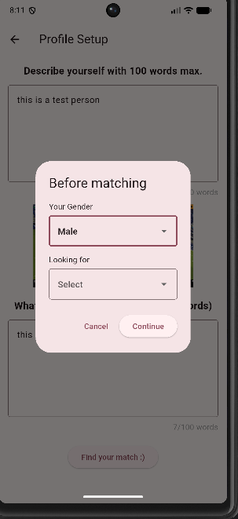
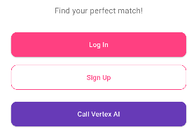
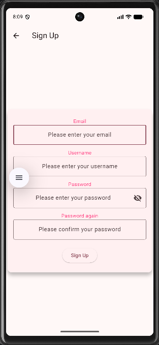
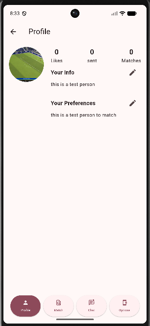

# Auvra
<p align="center">
  
</p>
**AI-powered dating focused on compatibility and meaningful connections.**

Auvra is a mobile dating application that uses profile information, preferences, and AI-assisted analysis to recommend potentially compatible matches.

> This repository is a public product showcase. The source code, credentials, infrastructure configuration, AI prompts, security rules, and proprietary matching logic are private.
<p align="Center">
  
  
  
  
</p>
## Features

* User registration and authentication
* Personalized profile creation
* Profile photo upload
* Gender and discovery preferences
* AI-assisted compatibility scoring
* Match explanations
* Ranked profile recommendations
* Like and dislike interactions
* Profile preview experience
* Private messaging — in development

## Technology

* Flutter and Dart
* Firebase Authentication
* Cloud Firestore
* Firebase Storage
* Firebase Cloud Functions
* Google Cloud Vertex AI
* Gemini models

## Current Status

Auvra is under active development.

The core authentication, profile setup, and AI-assisted match recommendation flows are functional. Current development is focused on mutual matches, real-time chat, profile management, navigation, privacy, and user safety.

## Screenshots

Product screenshots and mockups are available in:

```text
assets/screenshots/
```

All public previews use fictional or anonymized user information.

## Repository Purpose

This repository presents:

* The Auvra product concept
* Main application features
* Development progress
* Screenshots and product demonstrations
* High-level technical information

The application implementation is not open source.

## Security and Privacy

The following are not included publicly:

* Source code
* API keys and credentials
* Firebase configuration
* Database exports
* Security rules
* Cloud Functions
* AI prompts and matching logic
* Production logs
* Personal user data

## Developer

**Melih Aksoy**

* GitHub: [melihaaksoy](https://github.com/melihaaksoy)
* Portfolio: [melih-portfolio-sooty.vercel.app](https://melih-portfolio-sooty.vercel.app)

## Notice

Auvra is a development-stage product. Its name, design, features, and branding may change before release.

Copyright © 2026. All rights reserved.
